# Sonar Architecture

> **Note:** This document describes the architecture of a production-grade active sonar system, modelled in SysML v2 and studied for learning purposes. The project itself implements only a simplified ultrasonic distance meter on an Arduino UNO — a fraction of this architecture, chosen to be feasible within the project's time and budget constraints. Full implementation of a production-grade sonar is not the goal of this project.

> **Scope:** This study focuses on the software-intensive components of a sonar system — the Signal Generator, Beamformer, and Digital Signal Processor — and decomposes them to a greater depth than the hardware-dominated components (Power Amplifier, Transducer, Hydrophone Array), which are described at the component level only.

---

## How a Sonar Works

A sonar (Sound Navigation and Ranging) detects objects by emitting a sound pulse into water and listening for the echo. The time between emission and reception reveals how far away the object is. The frequency shift of the returning echo reveals whether the object is moving and how fast. By using an array of spatially distributed receivers, the system can also determine the direction the echo came from.

---

## Level 1 — System Overview

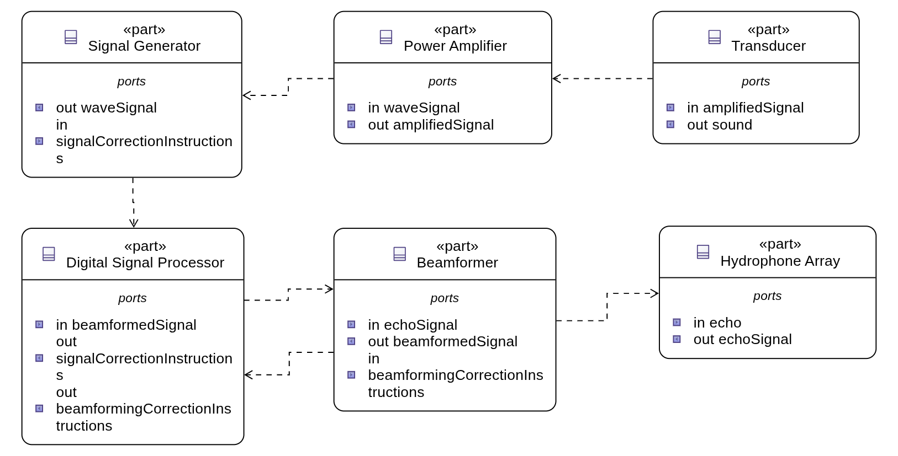

A production sonar consists of six major components arranged in two chains.

**Transmit chain:** the Signal Generator synthesises a precisely shaped pulse, the Power Amplifier boosts it to high power, and the Transducer converts it into physical sound emitted into the water.

**Receive chain:** the Hydrophone Array listens for returning echoes across many sensors, the Beamformer combines those signals to focus on a particular direction, and the Digital Signal Processor extracts range, velocity, bearing, and identity of every detected target.

The DSP also feeds corrections back to the Signal Generator and Beamformer, forming an adaptive closed loop that improves performance in real time.

---

## Level 2 — Components

### Signal Generator

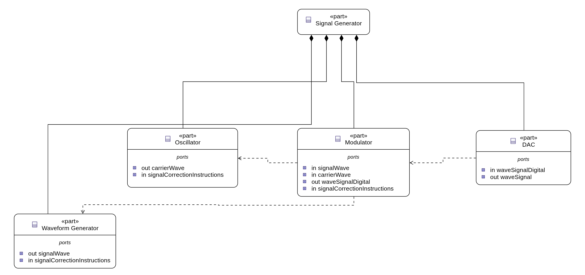

Produces the acoustic pulse that will be transmitted. It synthesises a precisely shaped waveform, modulates it onto a carrier frequency, and outputs it as an analog signal ready for amplification. It accepts correction instructions from the DSP to adapt pulse parameters in real time.

| Subcomponent | Role |
|---|---|
| **Waveform Generator** | Defines the shape of the outgoing pulse (e.g. linear frequency chirp) |
| **Oscillator** | Produces the stable high-frequency carrier wave |
| **Modulator** | Encodes the waveform onto the carrier; outputs a digital representation |
| **DAC** | Converts the digital signal to an analog voltage for the amplifier |

---

### Power Amplifier

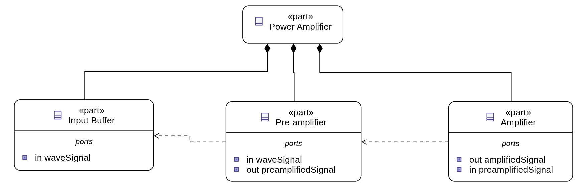

Takes the low-power analog signal from the Signal Generator and boosts it to the power levels required to propagate sound through water over operationally useful distances.

| Subcomponent | Role |
|---|---|
| **Input Buffer** | Receives and isolates the incoming signal |
| **Pre-amplifier** | Provides initial low-noise gain |
| **Amplifier** | Delivers the high-power output to the transducer |

---

### Transducer

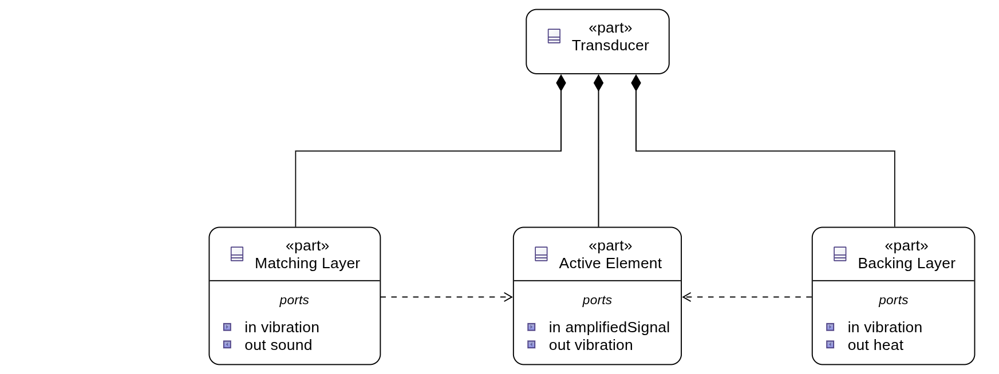

Converts the amplified electrical signal into physical sound waves. It uses the piezoelectric effect — a material that deforms mechanically when voltage is applied, pushing against the water to create a pressure wave.

| Subcomponent | Role |
|---|---|
| **Active Element** | Converts electrical energy into mechanical vibration via piezoelectricity |
| **Matching Layer** | Couples the vibration efficiently into water, minimising reflection at the interface |
| **Backing Layer** | Absorbs vibration propagating backward, dissipating it as heat and preventing ringing |

---

### Hydrophone Array

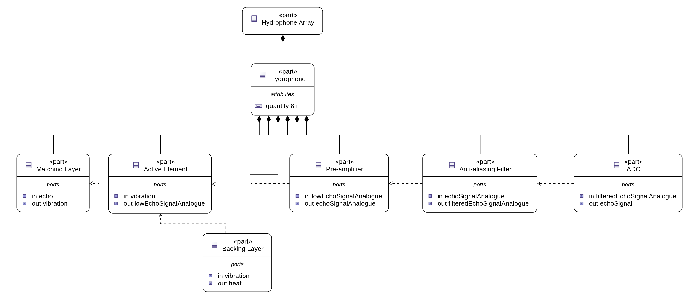

Listens for returning echoes across a spatially distributed set of sensors (8 or more). Having multiple receivers at known positions allows the system to determine the direction of an echo through timing differences between sensors.

Each hydrophone contains a full signal conditioning chain:

| Subcomponent | Role |
|---|---|
| **Matching Layer** | Converts incoming acoustic pressure to mechanical vibration |
| **Active Element** | Converts vibration to a weak analog electrical signal (reverse piezoelectric effect) |
| **Backing Layer** | Absorbs excess vibration to sharpen the impulse response |
| **Pre-amplifier** | Boosts the weak signal close to the sensor to minimise noise pick-up along the cable |
| **Anti-aliasing Filter** | Removes frequency content above the Nyquist limit before digitisation |
| **ADC** | Digitises the filtered analog signal for downstream processing |

---

### Beamformer

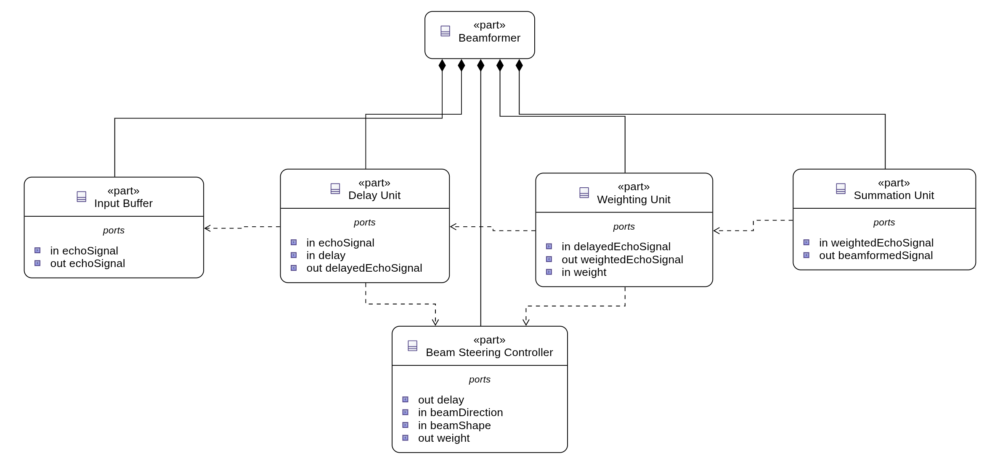

Combines the signals from all hydrophones to form a single directional "beam" — amplifying echoes arriving from a chosen direction and suppressing those from others. This is the acoustic equivalent of turning a directional microphone to face a speaker.

| Subcomponent | Role |
|---|---|
| **Input Buffer** | Stores incoming per-hydrophone digital signals |
| **Beam Steering Controller** | Computes the time delay and amplitude weight for each hydrophone channel based on the desired beam direction |
| **Delay Unit** | Shifts each channel in time so that echoes from the target direction arrive in phase |
| **Weighting Unit** | Applies amplitude weights to suppress side-lobe interference |
| **Summation Unit** | Adds all weighted, time-aligned channels into a single beamformed signal |

The Beam Steering Controller accepts correction instructions from the DSP to steer the beam adaptively.

---

### Digital Signal Processor

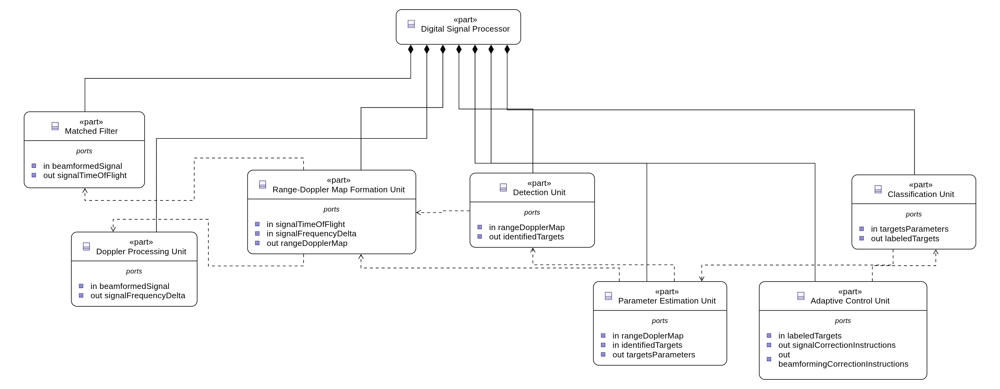

Extracts all useful information from the beamformed echo: range, velocity, bearing, and classification of every detected target. It also closes the adaptive loop by issuing corrections to the Signal Generator and Beamformer.

| Subcomponent | Role |
|---|---|
| **Matched Filter** | Cross-correlates the received signal with the transmitted waveform to maximise signal-to-noise ratio and determine time-of-flight |
| **Doppler Processing Unit** | Measures the frequency shift of the echo to determine target radial velocity |
| **Range-Doppler Map Formation Unit** | Combines range and velocity data into a 2D map of all detected returns |
| **Detection Unit** | Identifies which cells of the range-Doppler map contain real targets above the noise floor |
| **Parameter Estimation Unit** | Estimates precise range, velocity, bearing, and reflection strength for each detected target |
| **Classification Unit** | Labels targets by comparing their parameters against known signatures |
| **Adaptive Control Unit** | Uses classification results to issue waveform corrections to the Signal Generator and beam corrections to the Beamformer |

---

## Level 3 — Subcomponents

### Waveform Generator *(part of Signal Generator)*

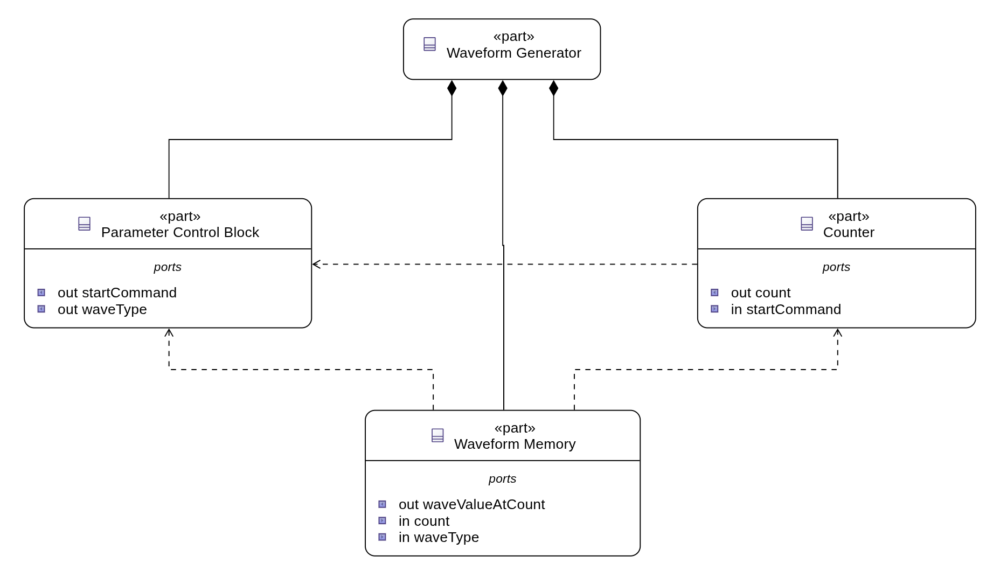

Plays back a pre-computed waveform sample by sample. The Parameter Control Block selects the waveform type and triggers playback. The Counter steps through sample indices. The Waveform Memory looks up the stored amplitude value for each (index, type) pair.

| Subcomponent | Role |
|---|---|
| **Parameter Control Block** | Selects waveform type and issues the start command |
| **Counter** | Increments the sample index on each clock tick |
| **Waveform Memory** | Returns the pre-computed amplitude value for the current index and waveform type |

---

### Oscillator *(part of Signal Generator)*

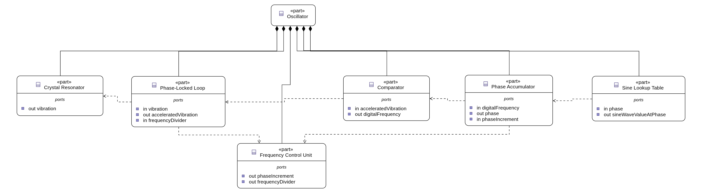

Generates a stable, precise sine wave at the desired carrier frequency using a crystal reference. The crystal provides frequency stability; a Phase-Locked Loop multiplies it to the operating frequency; a Sine Lookup Table converts accumulated phase to amplitude.

| Subcomponent | Role |
|---|---|
| **Crystal Resonator** | Vibrates at a stable reference frequency |
| **Phase-Locked Loop** | Multiplies the crystal frequency to the desired carrier frequency |
| **Frequency Control Unit** | Computes phase increment and frequency divider for the PLL |
| **Comparator** | Converts the analogue PLL output to a clean digital frequency signal |
| **Phase Accumulator** | Integrates frequency into a running phase value |
| **Sine Lookup Table** | Maps phase to the corresponding sine amplitude |

---

### Modulator *(part of Signal Generator)*

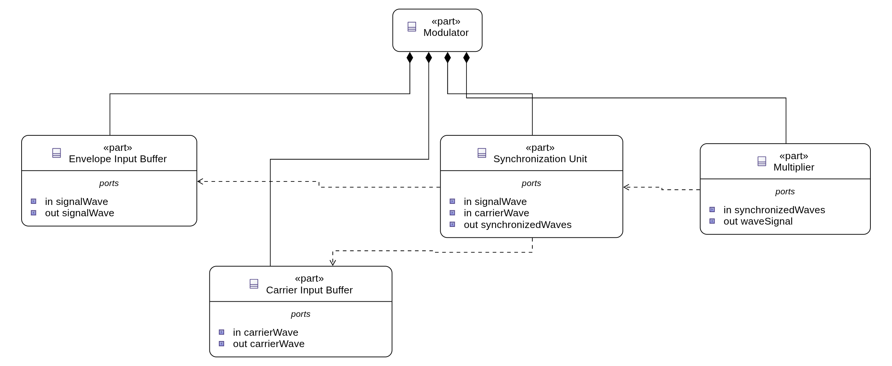

Combines the shaped waveform from the Waveform Generator with the carrier from the Oscillator to produce the final digital pulse. Synchronisation ensures both signals are phase-aligned before multiplication.

| Subcomponent | Role |
|---|---|
| **Envelope Input Buffer** | Buffers the incoming waveform (signal envelope) |
| **Carrier Input Buffer** | Buffers the incoming carrier wave |
| **Synchronisation Unit** | Aligns the timing of the two signals |
| **Multiplier** | Multiplies the synchronised signals, producing the modulated digital waveform |

---

### Beam Steering Controller *(part of Beamformer)*

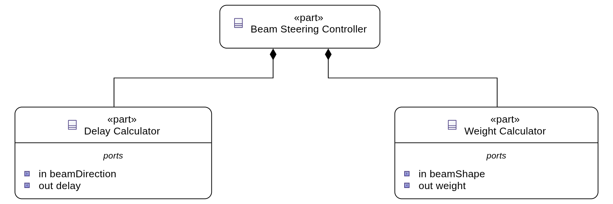

Translates a desired beam direction and shape into per-channel delay and weight values. The Delay Calculator uses the geometry of the hydrophone array and the target bearing to compute the time offset each channel needs. The Weight Calculator applies a window function to suppress side lobes.

| Subcomponent | Role |
|---|---|
| **Delay Calculator** | Computes per-channel time delays from the desired beam direction |
| **Weight Calculator** | Computes per-channel amplitude weights from the desired beam shape |

---

### Matched Filter *(part of Digital Signal Processor)*

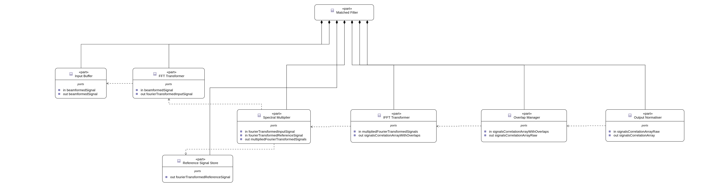

Performs cross-correlation between the received beamformed signal and the known transmitted waveform, implemented efficiently in the frequency domain. Both signals are Fourier-transformed, multiplied spectrally, and transformed back. This maximises the signal-to-noise ratio and produces a sharp time-of-flight peak.

| Subcomponent | Role |
|---|---|
| **Input Buffer** | Buffers the incoming beamformed signal |
| **FFT Transformer** | Converts the signal to the frequency domain |
| **Reference Signal Store** | Holds the pre-computed FFT of the transmitted waveform |
| **Spectral Multiplier** | Multiplies the signal and reference spectra element-wise |
| **IFFT Transformer** | Converts the product back to the time domain |
| **Overlap Manager** | Handles block boundaries using the overlap-add method to prevent aliasing |
| **Output Normaliser** | Normalises the correlation output to a consistent amplitude scale |

---

### Doppler Processing Unit *(part of Digital Signal Processor)*

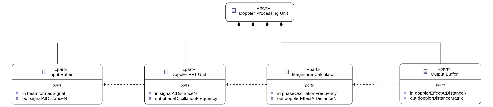

Measures the frequency shift of the echo at each range cell to determine target velocity. It operates on successive echo pulses at the same range and performs an FFT across the slow-time axis to resolve velocity.

| Subcomponent | Role |
|---|---|
| **Input Buffer** | Buffers the beamformed signal indexed by range |
| **Doppler FFT Unit** | Computes the frequency content across pulses at each range |
| **Magnitude Calculator** | Converts complex frequency output to Doppler magnitude |
| **Output Buffer** | Assembles results into a Doppler-distance matrix |

---

### Range-Doppler Map Formation Unit *(part of Digital Signal Processor)*

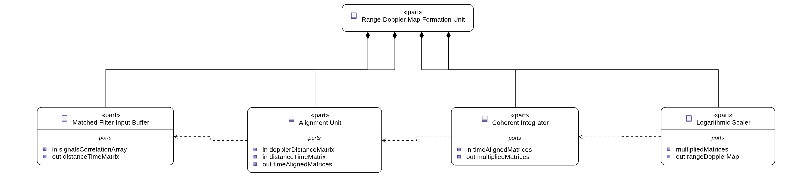

Combines the range information from the Matched Filter and the velocity information from the Doppler Processing Unit into a unified two-dimensional map. Each cell corresponds to a specific range and velocity bin; bright cells indicate potential targets.

| Subcomponent | Role |
|---|---|
| **Matched Filter Input Buffer** | Receives the correlation array from the Matched Filter |
| **Alignment Unit** | Aligns the range and Doppler matrices in time |
| **Coherent Integrator** | Multiplies aligned matrices to reinforce coherent returns |
| **Logarithmic Scaler** | Converts to decibel scale for detection thresholding |

---

### Parameter Estimation Unit *(part of Digital Signal Processor)*

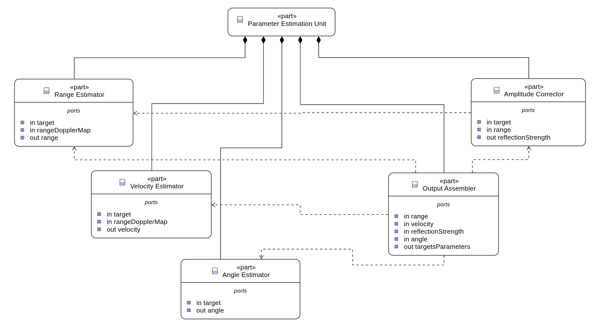

Estimates precise physical parameters for each detected target from its position in the range-Doppler map: distance, speed, bearing, and reflection strength.

| Subcomponent | Role |
|---|---|
| **Range Estimator** | Extracts target range from the range-Doppler map |
| **Velocity Estimator** | Extracts target radial velocity from the Doppler axis |
| **Angle Estimator** | Estimates target bearing from multi-beam phase information |
| **Amplitude Corrector** | Corrects echo amplitude for range-dependent propagation loss to yield true reflection strength |
| **Output Assembler** | Packages range, velocity, angle, and reflection strength into a single target record |

---

### Classification Unit *(part of Digital Signal Processor)*

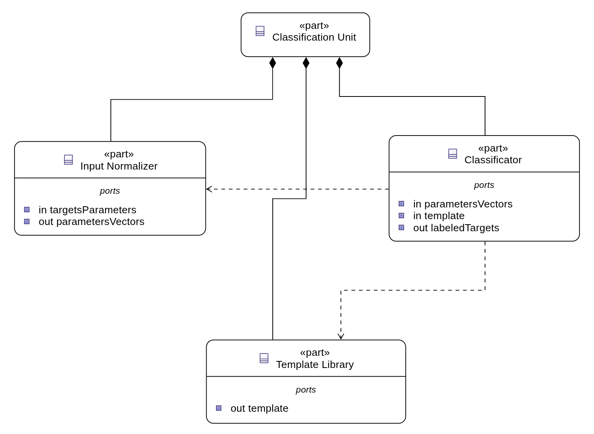

Identifies what each detected target is by comparing its measured parameters against a library of known signatures. Raw parameters are normalised into a standardised vector, then matched against stored templates.

| Subcomponent | Role |
|---|---|
| **Input Normaliser** | Normalises target parameters into a dimensionless parameter vector |
| **Template Library** | Stores reference signatures for known target types |
| **Classificator** | Compares parameter vectors against templates and outputs a labelled target list |
