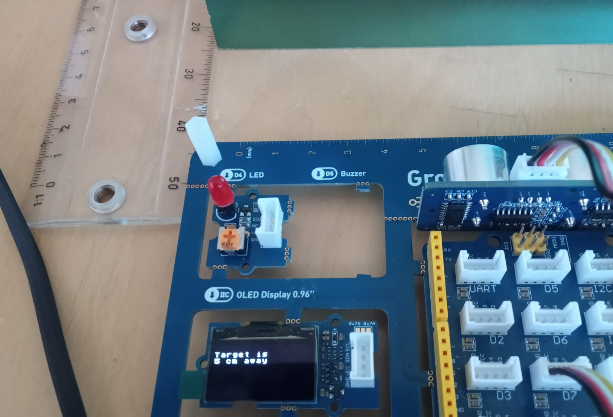

# Sonar

An Arduino UNO device that measures the distance to the nearest object and displays it on a small OLED screen.



## Project Structure

```
Sonar/
├── Sonar.ino
├── src/
│   ├── globals.h              # Project-wide types and constants
│   ├── hal/
│   │   ├── hal_gpio.h
│   │   ├── hal_gpio.cpp
│   │   ├── hal_oled.h
│   │   ├── hal_oled.cpp
│   │   ├── hal_serial.h
│   │   └── hal_serial.cpp
│   ├── drv/
│   │   ├── drv_ultrasonic.h
│   │   ├── drv_ultrasonic.cpp
│   │   ├── drv_oled.h
│   │   ├── drv_oled.cpp
│   │   ├── drv_serial.h
│   │   └── drv_serial.cpp
│   └── app/
│       ├── app_sonar.h
│       ├── app_sonar.cpp
│       ├── app_display.h
│       └── app_display.cpp
├── test/
│   ├── mock_hal_gpio.h        # HAL mock that injects synthetic sensor readings
│   ├── mock_hal_gpio.cpp
│   ├── test_drv_ultrasonic.cpp
│   ├── test_app_sonar.cpp
│   └── Makefile
├── Architecture.md            # Architecture of production-grade sonars
├── diagrams/                  # Internal composition diagrams of production-grade sonars
└── model/                     # SysML v2 model of the production-grade sonar
```

## Architecture

> For the theoretical architecture of a production-grade sonar system, see [Architecture.md](Architecture.md).

The firmware is organized in four strict horizontal layers. Each layer may only call the layer directly below it.

- **HAL** — the only layer that touches Arduino APIs. Split by peripheral so each driver pulls in only the hardware it needs.
- **Drivers** — device-specific logic built entirely on HAL. The OLED and Serial drivers share the same interface shape, enabling the display fallback below.
- **App** — orchestrates measurement and display. No hardware access; driver calls only.
- **Entry point** — `setup()` and `loop()` only.

## Software Development Standards

During development of this project, many guidelines for the development of production-grade mission-critical software, specified in standards like MISRA C, DO-178C, IEC 61508 and NASA's JPL Coding Standard were followed. See [Development_Practices.md](Development_Practices.md) for the full list.

## Testing

Unit tests run on the host (Linux/macOS). The HAL is replaced by a lightweight mock that injects synthetic sensor readings. Tests are written using equivalence partitioning and boundary value analysis: each test targets a specific input partition (timeout, below-minimum, at-minimum, interior, at-maximum, above-maximum).

```
make -C test
```

What is covered: `drv_ultrasonic` (pulse-to-distance conversion, timeout, out-of-range) and `app_sonar` (status propagation). The HAL and display layers are verified by flashing to hardware and manual testing.

---

## AI Usage

This project was developed collaboratively with **Claude**, used as a
pair programmer and subject-matter resource throughout.

The process was strictly developer-led. At every step, the AI presented options
with their trade-offs; the developer made all decisions. Code was written in small
chunks (approximately 10 lines at a time) and reviewed before work continued.
No code was written autonomously.

All architectural decisions — module structure, data types, algorithm parameters,
and testing strategy — were made by the developer.
